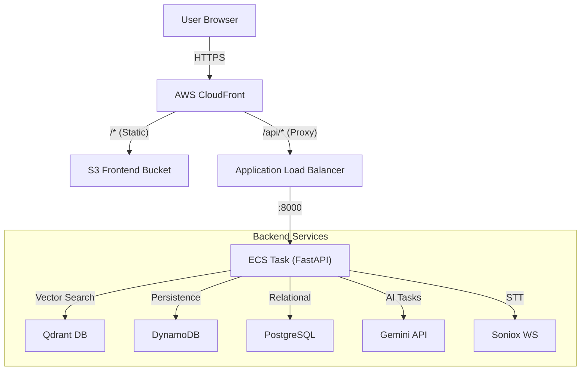

# MemRAG Chatbot

Multimodal AI chatbot cá nhân hóa xây dựng trên nền tảng **Google Agent Development Kit (ADK)**. Hệ thống kết hợp RAG (Retrieval-Augmented Generation), bộ nhớ dài hạn (Long-term memory), và khả năng xử lý đa phương thức để tạo ra trải nghiệm AI thông minh, ghi nhớ ngữ cảnh và hỗ trợ quản lý kiến thức hiệu quả.

**Live Demo:** [https://d3qrt08bgfyl3d.cloudfront.net](https://d3qrt08bgfyl3d.cloudfront.net)

---

## ✨ Features

- **🚀 Realtime Chat Streaming** — Sử dụng SSE (Server-Sent Events) để trả về token ngay khi được tạo (token-by-token).
- **📄 Multimodal PDF RAG** — Upload tài liệu PDF, AI tự động chunking, embedding và tìm kiếm ngữ nghĩa để trả lời có trích dẫn (citations).
- **🧠 Long-term Memory** — Tích hợp **mem0** để ghi nhớ thông tin cá nhân, sở thích và sự kiện quan trọng giữa các phiên hội thoại.
- **🎙️ Realtime Transcription & Translation** — Hỗ trợ transcription và dịch thuật thời gian thực (60+ ngôn ngữ) qua Soniox STT, tự động lưu trữ và đưa vào bộ nhớ RAG của meeting.
- **🌐 Wiki Knowledge Base** — Tự động tổng hợp kiến thức từ các tài liệu đã upload và các cuộc họp thành các bài Wiki có cấu trúc và đồ thị kiến thức (Knowledge Graph).
- **🖼️ Multimodal Vision** — Gửi kèm hình ảnh trong câu hỏi để AI phân tích và trả lời (sử dụng Gemini Vision).
- **💾 Session Persistence** — Lưu trữ lịch sử chat và trạng thái session bền vững trên AWS DynamoDB.
- **⚡ Performance Optimization** — Auto-summarization context khi hội thoại quá dài để tiết kiệm token và duy trì hiệu năng LLM.

---

## 🛠️ Tech Stack

| Layer | Technology |
|-------|-----------|
| **Frontend** | React 18, TypeScript, Vite, TailwindCSS, Zustand, React Query, React Flow |
| **Backend** | FastAPI, Python 3.11+, Google ADK, LLM Gemini 2.0/2.5 Flash |
| **Memory/RAG** | mem0 (Long-term), ADK Context Plugin (Short-term), LangChain |
| **Databases** | Qdrant (Vector DB), AWS DynamoDB (Sessions/Meetings), RDS PostgreSQL (Auth/User) |
| **Storage** | AWS S3 (PDF uploads & Frontend static hosting) |
| **Infrastructure** | AWS ECS (EC2 host mode), CloudFront (CDN & API Gateway), ALB, Terraform |
| **CI/CD** | GitHub Actions (Independent FE/BE pipelines) |

---

## 📐 Architecture

### High-Level Flow
Hệ thống sử dụng **CloudFront** làm điểm truy cập duy nhất (Single Entry Point), phục vụ cả Frontend tĩnh và proxy API về Backend để giải quyết vấn đề CORS và tối ưu hóa performance.



### Cloud Infrastructure Details
Dự án được triển khai trên AWS với cấu hình tối ưu chi phí (Free Tier friendly) nhưng vẫn đảm bảo tính ổn định:
- **Networking**: VPC với Public/Private subnets, NAT Gateway cho outbound traffic.
- **Compute**: EC2 t3.medium chạy ECS agent.
- **Network Mode**: Backend dùng `host` network mode để tối đa hóa performance và giảm latency.
- **Storage Persistence**: Qdrant data được lưu trên EBS volume (gp3) gắn cố định vào ECS Task.

---

## 💻 Local Development

### Prerequisites
- Python 3.11+ & [uv](https://docs.astral.sh/uv/)
- Node.js 20+ & npm
- Docker Desktop
- API Keys: `GEMINI_API_KEY`, `SONIOX_API_KEY` (optional)

### Quick Start with Docker (Recommended)
Cách nhanh nhất để khởi chạy toàn bộ môi trường (Backend, Qdrant, DynamoDB Local):

```bash
# Clone repository
git clone <repo-url>
cd proj2

# Cấu hình môi trường
cp backend/.env.example backend/.env
# Điền các API Key cần thiết vào backend/.env

# Khởi chạy dịch vụ
docker compose up -d
```
- Backend API & Docs: [http://localhost:8000/docs](http://localhost:8000/docs)
- Frontend: [http://localhost:5173](http://localhost:5173) (sau khi chạy FE manual bên dưới)

### Manual Setup

#### Backend
```bash
cd backend
uv sync
uv run python -m app.main
```

#### Frontend
```bash
cd frontend
npm ci
npm run dev
```

---

## ⚙️ Environment Variables

Tạo file `backend/.env` với các nội dung chính sau:

| Biến | Mô tả |
|------|-------|
| `GEMINI_API_KEY` | API Key từ Google AI Studio |
| `ALLOWED_ORIGINS` | JSON array, ví dụ: `["http://localhost:5173"]` |
| `STORAGE_BACKEND` | `local` (mặc định) hoặc `s3` |
| `QDRANT_URL` | Mặc định `http://localhost:6333` |
| `DYNAMODB_ENDPOINT_URL` | Local: `http://localhost:8001`, Prod: bỏ trống |
| `SONIOX_API_KEY` | Key cho tính năng Transcription thời gian thực |
| `JWT_SECRET_KEY` | Secret dùng để sign token (quan trọng cho Prod) |

---

## 🚀 CI/CD & Deployment

Dự án sử dụng GitHub Actions với 2 workflows độc lập:

1.  **Backend Pipeline (`ci-cd.yml`)**: 
    - Trigger khi thay đổi code trong `backend/`.
    - Flow: Lint → Test → Build Docker Image → Push ECR → Deploy ECS (Rolling update).
2.  **Frontend Pipeline (`deploy-frontend.yml`)**:
    - Trigger khi thay đổi code trong `frontend/`.
    - Flow: Build React app → Sync S3 → Invalidate CloudFront cache.

### Infrastructure as Code
Toàn bộ hạ tầng được quản lý bằng **Terraform** trong thư mục `infrastructure/`.
Để triển khai lần đầu:
```bash
cd infrastructure
terraform init
terraform apply
```

---

## 🔧 Troubleshooting

Các vấn đề thường gặp khi vận hành trên AWS:

- **EC2 Instance stopped**: Xảy ra khi cố gắng thay đổi instance type trên AWS account Free Tier.
  - *Fix:* `aws ec2 start-instances --instance-ids <id> --region ap-southeast-2`
- **Port 8000 conflict**: Do Backend dùng `host` network mode, nếu task cũ chưa cleanup xong, task mới sẽ fail.
  - *Fix:* Force deployment hoặc restart ECS service để cleanup port.
- **Qdrant Connection Timeout**: Backend khởi động nhanh hơn Qdrant hoặc Cloud Map DNS chưa cập nhật.
  - *Fix:* Restart Backend service sau khi Qdrant đã ở trạng thái RUNNING.
- **OOM Kill**: Qdrant hoặc Backend tiêu tốn quá nhiều RAM trên instance nhỏ.
  - *Fix:* Đã cấu hình Swap 2GB trên EBS để giảm thiểu tình trạng này.

---

## 📚 Tài liệu chi tiết

Để tìm hiểu sâu hơn về hệ thống, vui lòng tham khảo các tài liệu sau trong thư mục `docs/`:

- **[System Specification](file:///home/minhdd/pet_proj_v2/pet_proj/proj2/docs/spec.md)** — Đặc tả kỹ thuật và kiến trúc hiện tại.
- **[Testing Strategy](file:///home/minhdd/pet_proj_v2/pet_proj/proj2/docs/testing.md)** — Hướng dẫn kiểm thử và Mocking.
- **[Deployment Plan](file:///home/minhdd/pet_proj_v2/pet_proj/proj2/docs/deploy_plan.md)** — Kiến trúc AWS và hướng dẫn deploy.
- **[Wiki Knowledge Base](file:///home/minhdd/pet_proj_v2/pet_proj/proj2/docs/wiki.md)** — Cơ chế tự động tổng hợp kiến thức.
- **[Multi-Agent Architecture](file:///home/minhdd/pet_proj_v2/pet_proj/proj2/docs/multi-agent-architecture.md)** — Chi tiết về luồng xử lý của AI Agent.
- **[Data Isolation](file:///home/minhdd/pet_proj_v2/pet_proj/proj2/docs/memory.md)** — Cách hệ thống đảm bảo an toàn dữ liệu giữa các người dùng.

---

## 🛠️ Development Rules

Để đảm bảo tính ổn định và chất lượng của hệ thống, mọi đóng góp code cần tuân thủ:

1.  **Chạy Full Test Suite**: Trước khi hoàn thành bất kỳ bug fix hoặc tính năng mới nào, phải chạy toàn bộ hệ thống test (`cd backend && uv run pytest`).
2.  **Bổ sung Test Case**: Các tính năng mới phải có các test case tương ứng để đảm bảo độ bao phủ (coverage).
3.  **Cập nhật Tài liệu**: Mọi thay đổi quan trọng phải được phản ánh trong thư mục `docs/`, `CLAUDE.md` và `README.md`.

---

## 📁 Project Structure

```text
.
├── backend/            # FastAPI App, ADK Agents, RAG Logic
├── frontend/           # React SPA, Zustand, React Flow
├── infrastructure/     # Terraform (AWS Resources)
├── docs/               # Detailed documentation (Deploy, CI/CD, Specs)
├── .github/workflows/  # CI/CD Automation
└── docker-compose.yml  # Local development stack
```

---

## 📄 License
MIT
